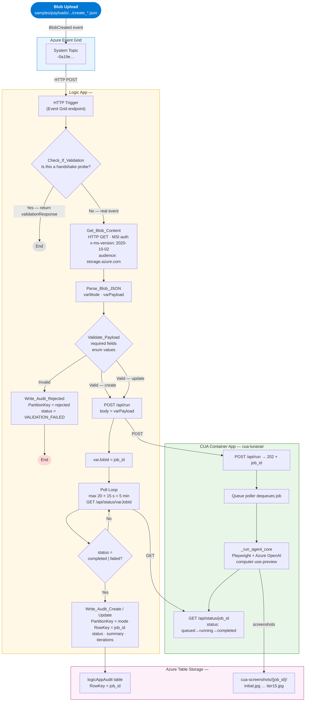

# CUA Dashboard — Code Documentation

> **Computer Use Agent (CUA) demo** that automates a browser to interact with the Zava Air customer complaints dashboard.
> An AI model (Azure OpenAI `computer-use-preview`) looks at screenshots and decides where to click, type, or scroll — just like a human would.

---

## Table of Contents

1. [Directory Layout](#directory-layout)
2. [Environment Variables](#environment-variables-env)
3. [Part 1 — Frontend](#part-1--frontend-staticindexhtml)
4. [Part 2 — Backend](#part-2--backend-apppy)
5. [Part 3 — Playwright Usage](#part-3--playwright-usage)
6. [Part 4 — The CUA Loop](#part-4--the-cua-loop)
7. [Part 5 — How a Full Run Works](#part-5--how-a-full-run-works)
8. [Part 6 — Queue-Driven API Mode](#part-6--queue-driven-api-mode)
9. [Part 7 — Logic App Automation Pipeline](#part-7--logic-app-automation-pipeline)
10. [Adding Scenarios](#adding-scenarios)
11. [Azure Deployment](#azure-deployment)

---

## Quick Start

The only production entry point is the **dashboard server**:

```bash
cd cua
uvicorn app:app --reload --port 8501
```

---

## Directory Layout

```
cua/
├── app.py                     # FastAPI backend — WebSocket + Playwright + CUA loop
├── static/
│   └── index.html             # Single-page dashboard (HTML/CSS/JS, no build step)
├── scenarios/
│   ├── simulated_create.json  # Example create scenario (loaded at startup)
│   └── simulated_update.json  # Example update scenario (loaded at startup)
├── screenshots/               # Auto-cleared on server start and each run
├── requirements.txt
└── .env                       # Azure credentials (never committed)
```

---

## Environment Variables (`.env`)

```bash
# ── Required ────────────────────────────────────────────────────────────────
AZURE_OPENAI_BASE_URL          # Azure OpenAI endpoint
AZURE_OPENAI_DEPLOYMENT        # Model deployment name, e.g. computer-use-preview
ZAVA_AIR_URL                   # URL of the complaints dashboard app

# ── Optional — Foundry Agent SDK (falls back to direct Azure OpenAI if unset)
FOUNDRY_PROJECT_ENDPOINT       # Azure AI Foundry project endpoint
FOUNDRY_MODEL_DEPLOYMENT_NAME  # Foundry model deployment (defaults to AZURE_OPENAI_DEPLOYMENT)

# ── Optional — CORS
ALLOWED_ORIGINS                # Comma-separated allowed origins, e.g. https://myapp.com
                               # Defaults to * with a warning if not set
```

> **Note:** The server validates all required variables at startup and exits with a clear message if any are missing, rather than crashing mid-request.

---

## Part 1 — Frontend (`static/index.html`)

A single HTML file with no build step. All logic is plain JavaScript.

### Layout

```
┌──────────────────────────────────────────────────────────────┐
│  Header: "CUA Dashboard"             [status badge: Idle]    │
├─────────────────────────┬────────────────────────────────────┤
│  LEFT PANEL             │  RIGHT PANEL                       │
│  Mode tabs:             │  Screenshot viewer (persistent     │
│    Browse / Create /    │    , no DOM rebuild on click) │
│    Update               │  Timeline strip (thumbnails)       │
│  Scenario picker        │  Console log (capped at 200 lines) │
│  System prompt          │                                    │
│    (editable textarea)  │                                    │
│  Task steps list        │                                    │
│  Target URL, Max Iters  │                                    │
│  [Run Agent] button     │                                    │
└─────────────────────────┴────────────────────────────────────┘
```

---

### Initialization (`init()`)

```javascript
async function init() {
  const res = await fetch('/api/defaults');  // GET /api/defaults
  // validates shape, shows error panel if server is down
  allData = await res.json();
  switchMode('browse');
}
```

On page load, JS fetches `/api/defaults`. If the server is down or returns an unexpected shape, a visible error panel replaces the form and the Run button is disabled.

The response contains:

| Field           | Description                          |
| --------------- | ------------------------------------ |
| `systemPrompts` | One prompt per mode                  |
| `scenarios`     | Nested by mode then scenario id      |
| `targetUrl`     | The complaints app URL               |
| `maxIterations` | Default `15`                         |

---

### Mode Switching (`switchMode(mode)`)

Three modes: **browse**, **create**, **update**.

Switching a mode:
1. Updates the active tab highlight
2. Loads the matching system prompt into the textarea
3. Populates the scenario picker dropdown (hidden for browse when only one scenario)
4. Renders the task list

---

### Task List

Tasks render as editable inputs in `<ol id="taskList">`. Uses **event delegation** — a single `change` listener and a single `click` listener on the `<ol>` rather than inline handlers on each item.

| Action          | How                                                      |
| --------------- | -------------------------------------------------------- |
| Edit text       | Type directly in the input                               |
| Add step        | Click `+ Add Step` → `addTask()`                         |
| Remove step     | Click `×` (handled by delegated `.btn-remove` click)     |

State lives in the `tasks` array.

---

### Running the Agent (`startAgent()`)

Called when the user clicks **Run Agent**. Guards against double-start:
`if (ws && ws.readyState === WebSocket.OPEN) return`.

1. Disables the button, resets screenshots and logs
2. Sets status badge to `Running`
3. Collects `config`: `{ mode, systemPrompt, tasks, targetUrl, maxIterations }`
4. Opens a **WebSocket** to `ws://<host>/ws/run`
5. On `ws.onopen` → sends `config` as JSON
6. On `ws.onmessage` → parses JSON defensively (malformed messages are logged and skipped), then dispatches by `msg.type`:

| `msg.type`   | UI behaviour                                                        |
| ------------ | ------------------------------------------------------------------- |
| `log`        | Appends a muted line to the Console (capped at 200 lines)           |
| `status`     | Updates the status badge                                            |
| `screenshot` | Adds thumbnail to timeline; updates persistent viewer `` src  |
| `reasoning`  | Appends an orange line to the Console                               |
| `done`       | Badge → "Complete"; shows summary overlay if `msg.summary` exists  |
| `error`      | Badge → "Error"; appends red log line                               |

`ws.onclose` distinguishes normal close (codes 1000/1005) from unexpected disconnect.
All exit paths (`done`, `error`, `onerror`, `onclose`) call `resetBtn()`.

---

### Screenshot Viewer

- A single `` element is created at startup and **reused** for every screenshot — only `.src` is swapped. This avoids DOM parsing and element creation on every click or iteration.
- The timeline strip tracks the active thumbnail with an `activeThumbIdx` integer instead of `querySelectorAll('.timeline-thumb')` on every update.

---

## Part 2 — Backend (`app.py`)

FastAPI server exposing:

| Endpoint             | Description                                                 |
| -------------------- | ----------------------------------------------------------- |
| `GET /`              | Serves `static/index.html`                                  |
| `GET /health`        | `{"status":"ok"}` — for Docker/Azure liveness probes        |
| `GET /api/defaults`  | Scenarios + system prompts + config                         |
| `WS /ws/run`         | Full CUA agent loop, streams progress back                  |
| `GET /screenshots/*` | Static file serving of captured screenshots                 |

---

### Startup

On startup the server:

1. Validates all required env vars — exits immediately with a clear list of missing ones
2. Configures structured logging (`logging` module, ISO timestamps)
3. Adds CORS middleware with origins from `ALLOWED_ORIGINS` env var
4. Clears the `screenshots/` directory

---

### Concurrency

A single `asyncio.Semaphore(1)` (`_agent_semaphore`) ensures **only one agent run at a time**. If a second WebSocket connection arrives while the semaphore is held, it receives an error message and is closed immediately.

The WebSocket handler is split into two functions:

| Function       | Responsibility                                                                   |
| -------------- | -------------------------------------------------------------------------------- |
| `ws_run()`     | Accepts the connection, checks the semaphore, delegates to `_run_agent()`        |
| `_run_agent()` | Validates the payload and runs the full agent loop                               |

---

### REST Endpoint: `GET /api/defaults`

```python
@app.get("/api/defaults")
async def get_defaults():
    all_scenarios = load_scenarios_from_disk()
    return {
        "systemPrompts": { "browse": ..., "create": ..., "update": ... },
        "scenarios": { ... },
        "targetUrl": ZAVA_AIR_URL,
        "maxIterations": MAX_ITERATIONS,
    }
```

**Scenario loading** (`load_scenarios_from_disk()`):
- Reads all `*.json` and `*.jsonl` files from `scenarios/`
- Detects mode automatically from field names (`update`-specific vs `create`-specific keys)
- Builds human-readable task step strings from the raw data
- Falls back to a built-in browse scenario if the directory is empty

---

### WebSocket Payload Validation

After receiving the config JSON, the server validates:

| Field       | Requirement                                 |
| ----------- | ------------------------------------------- |
| `mode`      | Must be one of `browse`, `create`, `update` |
| `tasks`     | Must be a non-empty list                    |
| `targetUrl` | Must be a non-empty string                  |

Malformed JSON or failed validation sends an `error` message and closes the connection.

---

### Two Auth / Client Paths

```python
def _get_openai_client_and_agent():
    if FOUNDRY_PROJECT_ENDPOINT:
        # ── Foundry Agent SDK path ──────────────────────────────────────────
        project_client = AIProjectClient(endpoint=..., credential=DefaultAzureCredential())
        openai_client  = project_client.get_openai_client()
        computer_use_tool = ComputerUsePreviewTool(display_width=..., environment="browser")
        agent = project_client.agents.create_version(
            agent_name  = "LunarAirComputerUseAgent",
            definition  = PromptAgentDefinition(model=..., tools=[computer_use_tool]),
        )
        return openai_client, {"name": agent.name, "type": "agent_reference"}
    else:
        # ── Direct Azure OpenAI path ────────────────────────────────────────
        token_provider = get_bearer_token_provider(DefaultAzureCredential(), ...)
        direct_client  = OpenAI(base_url=BASE_URL, api_key=token_provider)
        return direct_client, None
```

When `FOUNDRY_PROJECT_ENDPOINT` is set, the Foundry Agent SDK creates a versioned agent and attaches it via `extra_body: { agent_reference }`. Otherwise it calls the Azure OpenAI Responses API directly with `type: computer_use_preview` in the tools list.

---

## Part 3 — Playwright Usage

Playwright launches a **headless** Chromium browser, navigates to the complaints app, and executes whatever actions the AI model decides.

---

### Launching the Browser

```python
async with async_playwright() as pw:
    browser = await pw.chromium.launch(
        headless=True,
        args=["--window-size=1026,769", "--disable-extensions"],
    )
    context = await browser.new_context(viewport={"width": 1026, "height": 769})
    page    = await context.new_page()
    await page.goto(ZAVA_AIR_URL, wait_until="domcontentloaded")
```

---

### Chip Injection — key Playwright trick

Native `<select>` dropdown menus open an OS-level overlay that is **invisible** in a viewport screenshot. Before handing control to the AI, Playwright injects JavaScript that replaces every `<select>` with always-visible chip buttons:

```python
await page.evaluate(chip_js)   # built by build_chip_js([selectors])
```

The injected JS:

1. Creates a `<div class="cua-chips">` next to each matching `<select>`
2. For each `<option>` creates a `<button class="cua-chip">` with the same text
3. On chip click: sets `select.value`, fires `input` + `change` events, toggles `.active`
4. Hides the original `<select>` with `display:none`
5. Re-runs every 400 ms to catch dynamically-added options (e.g. subcategory after category)

Three chip injection variants are pre-built at startup:

| Variant          | Targets                                                  |
| ---------------- | -------------------------------------------------------- |
| `CHIP_JS_BROWSE` | `.filters select`                                        |
| `CHIP_JS_CREATE` | `.filters select` + `#newComplaintModal select`          |
| `CHIP_JS_UPDATE` | `.filters select` + `#updateModal select`                |

---

### Pre-filling Fields (Playwright as helper, not AI)

For **create** and **update** modes, Playwright fills structured fields before the AI sees the screen. This is faster and more reliable than having the AI type emails and phone numbers:

```python
await page.fill("#fPassengerName",  scenario["passenger_name"])
await page.fill("#fPassengerEmail", scenario["passenger_email"])
await page.fill("#fPassengerPhone", scenario["passenger_phone"])
await page.fill("#fPnr",            scenario["pnr"])
await page.fill("#fDescription",    "")   # intentionally blank — the AI types this
```

Dropdowns are set via `page.evaluate()` because chip injection hides the native `<select>`:

```python
async def set_select_by_label(page, selector, label):
    await page.evaluate("""
        ({ selector, label }) => {
            const sel = document.querySelector(selector);
            const opt = Array.from(sel.options).find(o => o.textContent.trim() === label);
            sel.value = opt.value;
            sel.dispatchEvent(new Event('change', { bubbles: true }));
        }
    """, {"selector": selector, "label": label})
```

---

### Taking a Screenshot

```python
async def take_screenshot(page, label):
    raw   = await page.screenshot(full_page=False, type="jpeg", quality=25)
    b64   = base64.b64encode(raw).decode()
    fname = f"{label}_{idx:03d}.jpg"
    (SHOTS_DIR / fname).write_bytes(raw)
    return b64, fname, "jpeg"
```

| Parameter          | Value / Reason                                               |
| ------------------ | ------------------------------------------------------------ |
| `full_page=False`  | Viewport only — the AI sees exactly what the browser shows   |
| `quality=25`       | Small file size, still legible for the model                 |
| Saved to disk      | Served at `/screenshots/<fname>` for the timeline            |
| Returned as base64 | Embedded directly in the API payload                         |

---

### Executing AI Actions (`handle_action`)

| `action.type`  | Playwright call                                    |
| -------------- | -------------------------------------------------- |
| `click`        | `page.mouse.click(x, y)`                           |
| `double_click` | `page.mouse.dblclick(x, y)`                        |
| `scroll`       | `page.mouse.wheel(dx, dy)` + `window.scrollBy()` (modal-aware) |
| `keypress`     | `page.keyboard.down/up` or `page.keyboard.press`   |
| `type`         | `page.keyboard.type(text, delay=20)`               |
| `wait`         | `asyncio.sleep(ms/1000)`                           |
| `drag`         | Skipped (not supported)                            |

Coordinates are clamped before use:

```python
def validate_coordinates(x, y):
    return max(0, min(x, DISPLAY_WIDTH)), max(0, min(y, DISPLAY_HEIGHT))
```

---

## Part 4 — The CUA Loop

Core feedback cycle that drives the agent:

```
┌──────────────────────────────────────────────────────────────────────┐
│                          CUA Feedback Loop                           │
│                                                                      │
│   1. Take screenshot ────────────────────────────────────┐           │
│                                                          ↓           │
│   6. Send screenshot back to model ◄─── 5. Execute action            │
│           │                                    ↑                     │
│           ↓                                    │                     │
│   2. Send to AI model (task + image)   4. Extract action from resp   │
│           │                                    ↑                     │
│           ↓                                    │                     │
│   3. Receive response ─────────────────────────┘                     │
│                                                                      │
│   → No computer_call in response = agent finished                    │
└──────────────────────────────────────────────────────────────────────┘
```

---

### Initial API Call

```python
response = client.responses.create(
    model=MODEL,
    tools=[{
        "type":           "computer_use_preview",
        "display_width":  DISPLAY_WIDTH,
        "display_height": DISPLAY_HEIGHT,
        "environment":    "browser",
    }],
    instructions=system_prompt,
    input=[{
        "role": "user",
        "content": [
            {"type": "input_text",  "text":      task_instructions},
            {"type": "input_image", "image_url": f"data:image/jpeg;base64,{b64}"},
        ],
    }],
    reasoning={"generate_summary": "concise"},
    truncation="auto",
)
```

| Parameter                    | Purpose                                                              |
| ---------------------------- | -------------------------------------------------------------------- |
| `type: computer_use_preview` | Tells the model it can return mouse/keyboard actions                 |
| `environment: "browser"`     | Tells the model what kind of surface it controls                     |
| `reasoning`                  | Requests a concise thinking summary (shown in orange in the console) |
| `truncation: "auto"`         | Model manages conversation history length automatically              |

---

### Follow-up API Calls (each iteration)

```python
input_content = [{
    "type":    "computer_call_output",
    "call_id": call_id,          # matches the model's computer_call
    "output": {
        "type":      "computer_screenshot",
        "image_url": f"data:image/jpeg;base64,{b64}",
    },
    "current_url": page.url,     # helps the model track navigation
}]

response = client.responses.create(
    model=MODEL,
    previous_response_id=response_id,   # chains conversation history
    tools=[...],
    input=input_content,
    truncation="auto",
)
```

`previous_response_id` chains the conversation so the model remembers what it has already done.

---

### Safety Checks

The API may return `pending_safety_checks` on a `computer_call`. These are auto-acknowledged in server mode (no terminal available):

```python
if hasattr(cc, "pending_safety_checks") and cc.pending_safety_checks:
    acknowledged = cc.pending_safety_checks
    input_content[0]["acknowledged_safety_checks"] = [
        {"id": c.id, "code": c.code, "message": c.message}
        for c in acknowledged
    ]
```

---

### Termination Conditions

The loop ends when:

1. Response has **no `computer_call` items** — model decided it is done
2. A **success toast** is detected on the page (`#toast` text matches expected string)
3. **Max iterations** reached — Playwright attempts a fallback click on Submit/Save

> A duplicate-screenshot detector (`hashlib.sha256` of raw bytes) triggers a scroll-rescue when two consecutive screenshots are identical, preventing the agent from getting stuck.

---

## Part 5 — How a Full Run Works

```
Browser (user)
    │  page load
    ▼
index.html ──GET /api/defaults──► app.py
           ◄── JSON (prompts, scenarios, targetUrl) ──

    [user clicks "Run Agent"]

index.html ──WebSocket /ws/run──► app.py
           ──send config JSON──►       │
                                       │  1.  Validate payload (mode, tasks, targetUrl)
                                       │  2.  Authenticate (Azure / Foundry)
                                       │  3.  Clear screenshots directory
                                       │  4.  Launch headless Chromium
                                       │  5.  Navigate to ZAVA_AIR_URL
                                       │  6.  Inject chip filters
                                       │  7.  Prefill form fields (create / update)
                                       │  8.  Take initial screenshot
                                       │  9.  Call AI model with screenshot + task
                                       │  10. Execute action from model
                                       │  11. Take new screenshot
                                       │  12. Send screenshot back to model
                                       │      ... repeat until done or max_iter ...
           ◄── {type:"screenshot"} ──  │
           ◄── {type:"reasoning"} ──   │
           ◄── {type:"done"} ──────────┘
```

---

## Running Locally

```bash
cd cua

# Install dependencies (first time)
pip install -r requirements.txt
playwright install chromium

# Set env vars
cp .env.example .env   # edit with your Azure credentials

# Start server
uvicorn app:app --reload --port 8501

# Verify health
curl http://localhost:8501/health
# → {"status":"ok"}

# Open dashboard
open http://localhost:8501
```

---

## Part 6 — Queue-Driven API Mode

In addition to the WebSocket UI, the server exposes a REST API backed by **Azure Storage Queue** (job intake) and **Azure Table Storage** (durable job status). The WebSocket path is completely unchanged — both modes run side by side.

### How It Works

```
Logic App / curl / any HTTP client
    │  POST /api/run  (scenario JSON)
    ▼
app.py ──enqueue──► Azure Storage Queue (cua-agent-jobs)
       ◄── 202 + job_id ──

_queue_poller()  (background task, polls every 3 s)
    │  dequeue message
    ▼
background_agent_run(job_id, config)
    │  acquires semaphore → _run_agent_core(config, table_send_fn)
    │  writes status updates → Azure Table Storage (cuaJobStatus)
    ▼
GET /api/status/{job_id}   ←  caller polls until status = "completed"
GET /api/jobs              ←  list 50 most recent jobs
```

---

### Additional Environment Variables

Add these to your `.env` (queue mode is disabled if `AZURE_STORAGE_ACCOUNT_NAME` is absent):

```bash
AZURE_STORAGE_ACCOUNT_NAME=<your-storage-account>
AZURE_STORAGE_QUEUE_NAME=cua-agent-jobs   # default if omitted
AZURE_STORAGE_TABLE_NAME=cuaJobStatus     # default if omitted
```

Authentication uses `DefaultAzureCredential` — run `az login` locally; on Azure the managed identity is picked up automatically. No connection strings or keys are stored.

---

### Required Azure RBAC Roles

Grant your identity (user or managed identity) the following roles on the storage account:

| Role                              | Purpose                         |
| --------------------------------- | ------------------------------- |
| `Storage Queue Data Contributor`  | Read and delete queue messages  |
| `Storage Table Data Contributor`  | Read and write job status rows  |

---

## Testing the API Agent

### 1. Verify the Server is Running

```bash
curl http://localhost:8501/health
# → {"status":"ok"}
```

Check that queue mode is active — you should see this in server logs:

```
Queue mode enabled (DefaultAzureCredential). Account: <name> | Queue: cua-agent-jobs | Table: cuaJobStatus
Queue poller task started.
Queue poller listening on 'cua-agent-jobs'.
```

---

### 2. Submit a Create Job via POST

Use the same format as the scenario files in `scenarios/`:

```bash
curl -s -X POST http://localhost:8501/api/run \
  -H "Content-Type: application/json" \
  -d @scenarios/sim_create_safety.json | jq .
```

Expected response (`202 Accepted`):

```json
{
  "job_id":   "b3f2a1c4-...",
  "status":   "queued",
  "poll_url": "/api/status/b3f2a1c4-..."
}
```

Supply your own `job_id` to make polling deterministic:

```bash
curl -s -X POST http://localhost:8501/api/run \
  -H "Content-Type: application/json" \
  -d '{
    "job_id":                "test-001",
    "passenger_name":        "Jane Smith",
    "passenger_email":       "jane@example.com",
    "passenger_phone":       "+1-555-0100",
    "flight_number":         "ZA505",
    "pnr":                   "PNR-SIM-099",
    "category":              "Safety",
    "subcategory":           "Unsafe Conditions",
    "severity":              "High",
    "agent":                 "Selene Park",
    "complaint_description": "Oxygen mask fell during descent."
  }' | jq .
```

---

### 3. Submit an Update Job

```bash
curl -s -X POST http://localhost:8501/api/run \
  -H "Content-Type: application/json" \
  -d @scenarios/simulated_update.json | jq .
```

---

### 4. Poll Job Status

```bash
JOB_ID="<job_id from step 2>"
curl -s http://localhost:8501/api/status/$JOB_ID | jq .
```

While running:

```json
{
  "status":     "running",
  "mode":       "create",
  "log":        ["Mode: create | 7 task steps", "Screenshots cleared", "..."],
  "created_at": "2026-03-03T14:24:50.286218+00:00"
}
```

When complete:

```json
{
  "status":       "completed",
  "mode":         "create",
  "summary":      "The complaint has been successfully submitted...",
  "iterations":   3,
  "log":          ["Mode: create | 7 task steps", "..."],
  "created_at":   "2026-03-03T14:24:50.286218+00:00",
  "completed_at": "2026-03-03T14:25:49.339957+00:00"
}
```

---

### 5. Poll Until Done (shell one-liner)

```bash
JOB_ID="test-001"
while true; do
  STATUS=$(curl -s http://localhost:8501/api/status/$JOB_ID | jq -r '.status')
  echo "$(date -u +%T) – $STATUS"
  [[ "$STATUS" == "completed" || "$STATUS" == "failed" ]] && break
  sleep 5
done
curl -s http://localhost:8501/api/status/$JOB_ID | jq '{status,summary,iterations}'
```

---

### 6. List Recent Jobs

```bash
curl -s http://localhost:8501/api/jobs \
  | jq '{count, jobs: [.jobs[] | {status,mode,iterations,created_at}]}'
```

---

### 7. Push Directly to Azure Storage Queue (bypass the REST API)

Useful for testing the poller without the HTTP layer:

```bash
az storage message put \
  --queue-name   cua-agent-jobs \
  --account-name <your-storage-account> \
  --auth-mode    login \
  --content '{
    "job_id":                "queue-direct-001",
    "passenger_name":        "Diego Nakamura",
    "passenger_email":       "diego.nakamura@example.com",
    "passenger_phone":       "+1-555-0114",
    "flight_number":         "ZA606",
    "pnr":                   "PNR-SIM-097",
    "category":              "Baggage",
    "subcategory":           "Delayed Baggage",
    "severity":              "Medium",
    "agent":                 "Atlas Rivera",
    "complaint_description": "Bag delayed by 3 days."
  }'
```

---

### 8. Logic App Integration

To call the agent from a Logic App:

**Step 1 — HTTP Action (POST)**

```
Method:  POST
URI:     http://<your-container-app-url>/api/run
Headers: Content-Type: application/json
Body:    @{triggerBody()}   (or a static scenario JSON)
```

**Step 2 — Initialize Variable**

```
Name:  job_id
Type:  String
Value: @{body('HTTP_POST')['job_id']}
```

**Step 3 — Do Until Loop**

```
Condition: @{variables('job_status')} is equal to  completed
Limit:     Count 30  /  Timeout PT5M
```

Inside the loop:

- **Delay** action: 10 seconds
- **HTTP Action (GET)**: `http://<url>/api/status/@{variables('job_id')}`
- **Set Variable `job_status`**: `@{body('HTTP_GET_Status')['status']}`

**Step 4 — Use the Result**

```
Summary:    @{body('HTTP_GET_Status')['summary']}
Iterations: @{body('HTTP_GET_Status')['iterations']}
```

---

## Adding Scenarios

Drop a `.json` file into `scenarios/`. The server reloads it on the next `/api/defaults` call — no restart needed when running with `--reload`.

### Create scenario format

```json
{
  "id":                    "my_scenario",
  "name":                  "Human-readable name",
  "passenger_name":        "Jane Smith",
  "passenger_email":       "jane@example.com",
  "passenger_phone":       "+1-555-0199",
  "flight_number":         "ZA202",
  "pnr":                   "PNR-SIM-099",
  "category":              "Baggage",
  "subcategory":           "Delayed Baggage",
  "severity":              "Medium",
  "agent":                 "Selene Park",
  "complaint_description": "My bag did not arrive."
}
```

> **Important:** `flight_number` must be an existing flight in the database (`ZA*` prefix). `agent` must be one of the eight agents configured in `server.js`. `category` must match the UI label exactly (e.g. `Booking & Refunds`, not `Booking`).

### Update scenario format

```json
{
  "id":                    "my_update",
  "name":                  "Human-readable name",
  "target_passenger_name": "Jane Smith",
  "target_flight_number":  "ZA202",
  "target_pnr":            "PNR1001",
  "new_status":            "Resolved",
  "new_severity":          "Low",
  "new_agent":             "Selene Park",
  "new_score":             "4.0",
  "new_notes":             "Issue resolved and customer notified."
}
```

> **Important:** `target_pnr` must match an existing complaint in the database. Use real PNRs such as `PNR1001`, `PNR5005`, `PNR1015` etc. (see the sample payloads table in Part 7 for a full reference).

---

## Azure Deployment

### Infrastructure

| Resource                  | Name                       | Resource Group  | Subscription |
| ------------------------- | -------------------------- | --------------- | ------------ |
| Container Registry        | `<your-acr>`       | `rg-complaints` | `<sub-id>`   |
| Container App Environment | `<your-managed-env>`       | `rg-complaints` | `<sub-id>`   |
| Container App             | `cua-lunarair`             | `rg-complaints` | `<sub-id>`   |
| Storage Account           | `<your-storage-account>`           | `rg-databases`  | `<sub-id>`   |
| Blob Container            | `payloads`                 | —               | —            |
| Blob Container            | `cua-screenshots`          | —               | —            |
| Table                     | `logicAppAudit`            | —               | —            |
| Logic App (Consumption)   | `<your-logic-app>` | `rg-complaints` | `<sub-id>`   |
| Event Grid System Topic   | `<your-storage-account>-0a19e10e…` | `rg-databases`  | `<sub-id>`   |
| UAMI                      | `<your-uami-name>`      | `rg-sc`         | `<uami-sub-id>`   |
| AI Foundry Resource       | `<your-foundry>`  | `rg-sc`         | `<uami-sub-id>`   |

### UAMI Details

| Property     | Value                                    |
| ------------ | ---------------------------------------- |
| Client ID    | `<your-uami-client-id>`  |
| Principal ID | `<your-uami-principal-id>`  |

---

---

## Part 7 — Logic App Automation Pipeline

The Logic App provides a fully automated, event-driven path that requires no human interaction: a JSON payload file dropped into blob storage is automatically picked up, validated, sent to the CUA agent, and audited — end to end.



```
Azure Blob Storage (<your-storage-account> / payloads container)
    │  BlobCreated event
    ▼
Event Grid System Topic  ──►  Logic App HTTP trigger (<your-logic-app>)
    │
    │  Step 1: Subscription validation handshake (auto-handled)
    │  Step 2: Check_If_Validation — is this a real event or a validation probe?
    │  Step 3: Get_Blob_Content — MSI-authenticated HTTP GET to blob URL
    │           Headers: x-ms-version: 2020-10-02
    │           Auth:    Managed Identity audience https://storage.azure.com/
    │  Step 4: Parse blob JSON → varMode, varPayload
    │  Step 5: Validate_Payload — required fields + enum checks
    │           • create: passenger_name, email, phone, flight, pnr, category, severity, agent
    │           • update: target_pnr, new_status, new_severity, new_agent
    │           • Rejects with VALIDATION_FAILED if any check fails
    │  Step 6: POST /api/run  →  receive job_id  (stored in varJobId)
    │  Step 7: Poll loop  (max 20 × 15 s = 5 min)
    │           GET /api/status/{job_id}  until status = completed | failed
    │  Step 8: Write_Audit_* → logicAppAudit table (Azure Table Storage)
    │           PartitionKey = mode,  RowKey = job_id
    ▼
Azure Table Storage (<your-storage-account> / logicAppAudit)
    PartitionKey  = "create" | "update" | "rejected"
    RowKey        = CUA job_id  (also = screenshot folder in cua-screenshots)
    blobUrl       = source blob URL
    status        = "completed" | "failed" | "VALIDATION_FAILED"
    summary       = agent summary text
    iterations    = number of CUA iterations used
    timestamp     = ISO 8601 UTC
```

### Audit Table ↔ Screenshots Link

`RowKey` in `logicAppAudit` equals the CUA `job_id` which is also the folder name under `cua-screenshots/{job_id}/`. To view screenshots for any audit row:

```bash
az storage blob list \
  --account-name <your-storage-account> \
  --container-name cua-screenshots \
  --prefix "<RowKey>/" \
  --auth-mode login \
  --query "[].name" -o tsv
```

### Logic App Bicep Files

| File                          | Purpose                                                                     |
| ----------------------------- | --------------------------------------------------------------------------- |
| `infra/logicapp.bicep`        | Full workflow definition — trigger, all actions, polling loop, audit writes |
| `infra/logicapp-rbac.bicep`   | RBAC: Blob Data Reader + Table Data Contributor for the Logic App MSI. Also declares `tableService` + `logicAppAudit` table resources (idempotent) |
| `infra/eventgrid.bicep`       | Event Grid subscription — `BlobCreated` on `payloads` container → Logic App |
| `infra/main.bicep`            | Orchestrates all modules; `logicappRbac` and `eventgrid` modules scope to `rg-databases` |

### Key Implementation Details

**Bearer auth on blob fetch** — Azure Blob Storage API versions earlier than `2020-10-02` do not support OAuth Bearer tokens. The `Get_Blob_Content` HTTP action must include:

```json
"headers": { "x-ms-version": "2020-10-02" }
```

Without this header the API defaults to an older version and returns `AuthenticationFailed: Authentication scheme Bearer is not supported in this version` even when the MSI role is correctly assigned.

**Table creation via Bicep** — `logicAppAudit` is created declaratively in `logicapp-rbac.bicep`:

```bicep
resource tableService 'Microsoft.Storage/storageAccounts/tableServices@2023-05-01' = {
  parent: storageAccount
  name: 'default'
}
resource auditTable 'Microsoft.Storage/storageAccounts/tableServices/tables@2023-05-01' = {
  parent: tableService
  name: 'logicAppAudit'
}
```

This is idempotent — redeployment will not fail if the table already exists.

**Payload validation** — The Logic App validates payloads in two stages:
1. `Check_If_Validation` — skips real processing for Event Grid subscription validation probes
2. `Validate_Payload` + `Validate_Create_Or_Update` — checks required fields and enum values; rejected payloads write a `rejected` audit row and terminate without calling the CUA API

### Uploading Payloads

```bash
az storage blob upload \
  --account-name <your-storage-account> \
  --container-name payloads \
  --name "payloads/2026/03/09/09/create_baggage.json" \
  --file "samples/payloads/2026/03/09/09/create_baggage.json" \
  --overwrite \
  --auth-mode login
```

The blob name path (`payloads/{YYYY}/{MM}/{DD}/{HH}/filename.json`) is the convention expected by the Event Grid subscription filter. Uploading the same file with `--overwrite` re-triggers the pipeline.

### Sample Payloads

All sample payloads live in `samples/payloads/2026/03/09/`. They use real reference data from the `custcomplaints` PostgreSQL schema:

**Valid flights (ZA\* prefix only):**
`ZA101, ZA110, ZA202, ZA221, ZA303, ZA332, ZA404, ZA443, ZA505, ZA554, ZA606, ZA707, ZA808, ZA909, ZA1010`

**Valid agents:**
`Luna Vasquez, Neil Armstrong II, Selene Park, Orion Bailey, Cassidy Moon, Atlas Rivera, Nova Singh, Cosmo Lee`

**Valid categories (as shown in the UI):**
`Baggage, Booking & Refunds, Customer Service, Flight Operations, In-Flight Service, Safety, Seating, Special Assistance`

> **Note:** The PostgreSQL column stores `Booking` but the UI displays `Booking & Refunds`. Payloads should use the UI label; `server.js` maps it on submission.

| Folder/File                          | Mode   | Passenger       | Flight | PNR         |
| ------------------------------------ | ------ | --------------- | ------ | ----------- |
| `09/create_baggage.json`             | create | Kenji Iwata     | ZA554  | PNR-SIM-001 |
| `09/create_flight_ops.json`          | create | Diego Nakamura  | ZA606  | PNR-SIM-002 |
| `09/create_refund.json`              | create | Oliver Leclerc  | ZA303  | PNR-SIM-003 |
| `09/create_safety.json`              | create | Fatima Müller   | ZA707  | PNR-SIM-004 |
| `09/create_seating.json`             | create | Chloe Kim       | ZA808  | PNR-SIM-005 |
| `09/create_wheelchair.json`          | create | Sam Reeves      | ZA221  | PNR-SIM-006 |
| `10/update_baggage.json`             | update | Ava Carter      | ZA101  | PNR1001     |
| `10/update_safety.json`              | update | Emma Brown      | ZA707  | PNR5005     |
| `10/update_wheelchair.json`          | update | Elif Okafor     | ZA707  | PNR1015     |
| `11/invalid_bad_severity.json`       | create | —               | ZA909  | PNR-SIM-102 |
| `11/invalid_missing_email.json`      | create | —               | ZA443  | PNR-SIM-101 |

The two files under `11/` are intentionally invalid (bad severity enum / missing email) and are used to verify that the Logic App validation step rejects them and writes `rejected` audit rows without calling the CUA API.

---

### Deployment Commands (run in order)

**Step 1 — Create blob container for screenshots:**

```bash
az storage container create \
  --subscription <your-subscription-id> \
  --account-name <your-storage-account> \
  --name         cua-screenshots \
  --auth-mode    login
```

**Step 2 — Deploy storage RBAC (Blob/Queue/Table Data Contributor for UAMI):**

```bash
az deployment group create \
  --subscription   <your-subscription-id> \
  --resource-group rg-databases \
  --template-file  infra/storage-rbac.bicep \
  --parameters     storageAccountName=<your-storage-account> \
                   uamiPrincipalId=<your-uami-principal-id>
```

**Step 3 — Grant AcrPull to UAMI:**

```bash
az role assignment create \
  --subscription            <your-subscription-id> \
  --role                    "AcrPull" \
  --assignee-object-id      <your-uami-principal-id> \
  --assignee-principal-type ServicePrincipal \
  --scope /subscriptions/<your-subscription-id>/resourceGroups/rg-complaints/providers/Microsoft.ContainerRegistry/registries/<your-acr>
```

**Step 4 — Grant Azure AI User on Foundry resource (enables agents/write):**

```bash
az role assignment create \
  --subscription            <your-uami-subscription-id> \
  --role                    "Azure AI User" \
  --assignee-object-id      <your-uami-principal-id> \
  --assignee-principal-type ServicePrincipal \
  --scope /subscriptions/<your-uami-subscription-id>/resourceGroups/rg-sc/providers/Microsoft.CognitiveServices/accounts/<your-foundry>
```

**Step 5 — Build and push Docker image:**

```bash
az acr build \
  --subscription   <your-subscription-id> \
  --resource-group rg-complaints \
  --registry       <your-acr> \
  --image          cua-lunarair:latest \
  cua/
```

**Step 6 — Deploy Container App:**

```bash
az deployment group create \
  --subscription   <your-subscription-id> \
  --resource-group rg-complaints \
  --template-file  infra/cua-containerapp.bicep \
  --parameters \
      acrLoginServer=<your-acr>.azurecr.io \
      cuaImage=<your-acr>.azurecr.io/cua-lunarair:latest \
      azureOpenAiBaseUrl=https://<your-foundry>.cognitiveservices.azure.com/openai/v1/ \
      azureOpenAiDeployment=computer-use-preview \
      foundryProjectEndpoint=https://<your-foundry>.services.ai.azure.com/api/projects/semantic-caching-foundry1 \
      foundryModelDeploymentName=computer-use-preview \
      zavaAirUrl=https://<your-webapp>.<your-env>.eastus2.azurecontainerapps.io/
```

**Force restart / redeploy after config changes:**

```bash
az containerapp update \
  --subscription   <your-subscription-id> \
  --resource-group rg-complaints \
  --name           cua-lunarair \
  --image          <your-acr>.azurecr.io/cua-lunarair:latest \
  --set-env-vars   FORCE_RESTART="$(date +%s)"
```

---

### Notes

- **Playwright base image:** `mcr.microsoft.com/playwright/python:v1.58.0-jammy`
- **Screenshots** stored in blob at `cua-screenshots/{job_id}/{label}.jpg` using UAMI auth
- **`AZURE_CLIENT_ID`** env var selects the UAMI for `DefaultAzureCredential()` in all SDK calls
- **Foundry RBAC role required:** `Azure AI User` on the Foundry resource scope (not `Azure AI Developer`)
